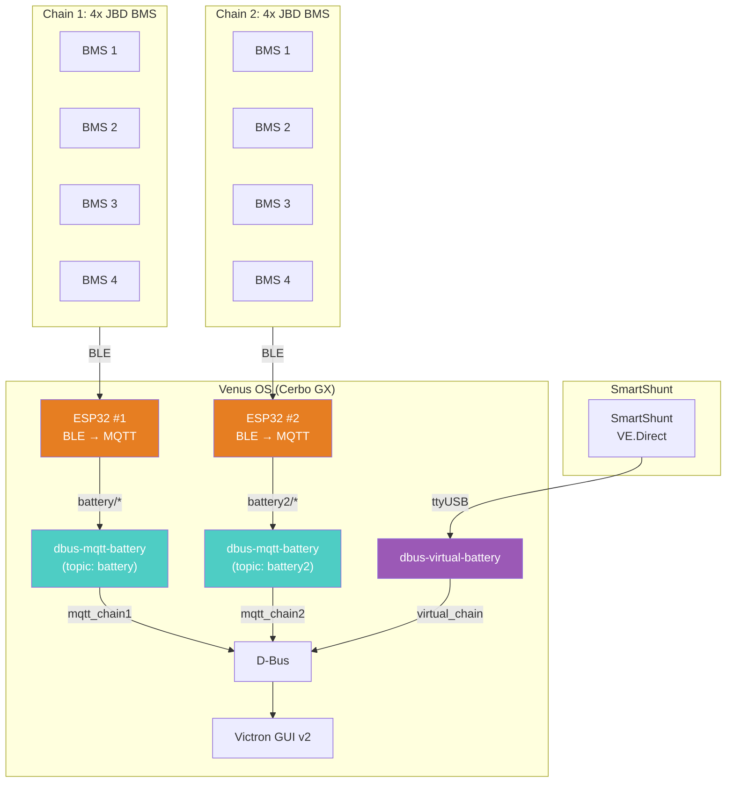

# dbus-mqtt-battery

[](https://github.com/victron-venus/dbus-mqtt-battery/actions/workflows/ci.yml)
[](https://opensource.org/licenses/MIT)
[](https://github.com/victron-venus/dbus-mqtt-battery/releases)
[](https://github.com/victron-venus/dbus-mqtt-battery/releases)
[](https://www.python.org/downloads/)
[](https://github.com/victronenergy/venus)
[](https://github.com/victron-venus/dbus-mqtt-battery)
[](https://github.com/victron-venus/dbus-mqtt-battery/stargazers)
[](https://github.com/victron-venus/dbus-mqtt-battery/network/members)
[](https://github.com/victron-venus/dbus-mqtt-battery/watchers)
[](https://github.com/victron-venus/dbus-mqtt-battery/graphs/contributors)
[](https://github.com/victron-venues/dbus-mqtt-battery/issues)
[](https://github.com/victron-venus/dbus-mqtt-battery/issues?q=is%3Aissue+is%3Aclosed)
[](https://github.com/victron-venus/dbus-mqtt-battery/pulls)
[](https://github.com/victron-venus/dbus-mqtt-battery/commits/main)
[](https://github.com/victron-venus/dbus-mqtt-battery)
[](https://github.com/victron-venus/dbus-mqtt-battery)
[](https://github.com/victron-venus/dbus-mqtt-battery/graphs/commit-activity)
[](https://github.com/victron-venus/dbus-mqtt-battery/pulls)
[](https://www.python.org/)
[](https://community.victronenergy.com/)

---

## Release Channels & CI/CD

This repository provides automated build archives for Victron Venus OS installations:

- **Stable Releases**: Tagged as `vX.Y.Z` (e.g., `v1.0.0`). Contains packaged Venus OS installer tarballs (`dbus-mqtt-battery-*.tar.gz`).
- **Pre-releases**: Tagged with `-rc.N` or `-beta.N`. Automatically flagged as Pre-release on GitHub Releases to isolate driver testing on Venus OS hardware.
- **Nightly Builds**: Built daily at 02:00 UTC. Generates a fresh `dbus-mqtt-battery-nightly.tar.gz` package published to the **[Nightly Build Release](https://github.com/victron-venus/dbus-mqtt-battery/releases/tag/nightly)**.

---

## Completed Features

- ✅ **CI/CD Releases & Nightly Builds**: Venus OS installer tarball packaging configured for automated releases

---

## System Architecture



## Services

Services are created dynamically based on configuration:

| Service | D-Bus Name | MQTT Topic | Description |
|---------|------------|------------|-------------|
| Chain 1 | `com.victronenergy.battery.mqtt_chain1` | `battery/` | First battery chain |
| Chain 2 | `com.victronenergy.battery.mqtt_chain2` | `battery2/` | Second battery chain |
| Chain N | `com.victronenergy.battery.mqtt_chainN` | `batteryN/` | Nth battery chain |
| Virtual | `com.victronenergy.battery.virtual_chain` | — | SmartShunt minus all chains (optional) |

## Installation

### Option 1: SetupHelper (Recommended)

The easiest way to install is via [SetupHelper](https://github.com/kwindrem/SetupHelper) PackageManager:

1. **Install SetupHelper** (if not already installed):
   ```bash
   wget -qO - https://github.com/kwindrem/SetupHelper/archive/latest.tar.gz | tar -xzf - -C /data
   mv /data/SetupHelper-latest /data/SetupHelper
   /data/SetupHelper/setup
   ```

2. **Add package via GUI**:
   - Settings → PackageManager → Inactive packages → **new**
   - Package name: `dbus-mqtt-battery`
   - GitHub user: `victron-venus`
   - Branch/tag: `latest`
   - Proceed → Download → Install

3. **Done!** The package will:
   - Automatically reinstall after Venus OS updates
   - Update from GitHub when new versions are available
   - Provide GUI controls via PackageManager

4. **Configure** (optional, create files before or after install):
   ```bash
   ssh Cerbo
   mkdir -p /data/setupOptions/dbus-mqtt-battery

   # Number of battery chains (default: 2)
   echo "2" > /data/setupOptions/dbus-mqtt-battery/chains

   # Batteries per chain (default: 4)
   echo "4" > /data/setupOptions/dbus-mqtt-battery/batteries

   # SmartShunt serial port for virtual battery (default: ttyUSB0)
   echo "ttyUSB0" > /data/setupOptions/dbus-mqtt-battery/smartshunt

   # Disable virtual battery if you don't have SmartShunt (enabled by default)
   echo "false" > /data/setupOptions/dbus-mqtt-battery/enableVirtual
   ```

   > **Note**: Virtual battery is **enabled by default**. If you don't have a SmartShunt or don't need virtual battery calculation, disable it **before** installation by setting `enableVirtual` to `false`.

5. **Reinstall** to apply configuration changes:
   - PackageManager → dbus-mqtt-battery → Reinstall

### Configuration Options

| Option | File | Default | Description |
|--------|------|---------|-------------|
| Chains | `chains` | `2` | Number of battery chains (1-10) |
| Batteries | `batteries` | `4` | Batteries per chain |
| Cells/BMS | `cellsPerBms` | `4` | Cells per BMS module (4 for 12V LiFePO4) |
| Virtual | `enableVirtual` | `true` | Enable virtual battery calculation |
| SmartShunt | `smartshunt` | `ttyUSB0` | Serial port for SmartShunt |

**Examples:**
- 1 chain, 4 batteries, no virtual: `chains=1`
- 2 chains, 4 batteries each, with virtual: `chains=2`, `enableVirtual=true`
- 5 chains, 8 batteries each: `chains=5`, `batteries=8`

### How PackageManager Works

PackageManager discovers packages by scanning `/data/` for directories containing both a `version` file and a `setup` script. The `setup` script (sourced from this repo) is executed with the `INSTALL` action by SetupHelper, which:

- Creates chain services (`dbus-mqtt-chain1`, `dbus-mqtt-chain2`, etc.) based on configuration
- Creates virtual battery service (`dbus-virtual-chain`) if enabled
- Copies Python scripts to `/data/dbus-mqtt-battery/`

The `gitHubInfo` file tells PackageManager where to download from:
```
victron-venus:latest
```

### Uninstall

Via PackageManager: Settings → PackageManager → dbus-mqtt-battery → Uninstall

Via CLI:
```bash
ssh Cerbo '/data/dbus-mqtt-battery/setup uninstall'
```

### Option 2: CLI Install (for GUI v2 users)

If you're using GUI v2 (where PackageManager menu is not available), install via SSH:

```bash
ssh Cerbo

# Download and install
cd /data && rm -rf dbus-mqtt-battery
wget -qO - https://github.com/victron-venus/dbus-mqtt-battery/archive/latest.tar.gz | tar -xzf -
mv dbus-mqtt-battery-latest dbus-mqtt-battery
chmod +x /data/dbus-mqtt-battery/setup

# Configure (optional, before install)
mkdir -p /data/setupOptions/dbus-mqtt-battery
echo "2" > /data/setupOptions/dbus-mqtt-battery/chains        # Number of chains
echo "4" > /data/setupOptions/dbus-mqtt-battery/batteries     # Batteries per chain
echo "true" > /data/setupOptions/dbus-mqtt-battery/enableVirtual  # Enable virtual battery
echo "ttyUSB4" > /data/setupOptions/dbus-mqtt-battery/smartshunt  # SmartShunt port

# Install
/data/dbus-mqtt-battery/setup install

# Update (re-run same commands)
# Uninstall
/data/dbus-mqtt-battery/setup uninstall
```

### Option 3: Deploy Script (from local machine)

```bash
cd ~/victron/dbus-mqtt-battery
chmod +x deploy.sh
./deploy.sh
```

This downloads the latest version from GitHub and runs `setup install`.

## Documentation

- [System Architecture](./.github/docs/system-architecture.md) - Data flow diagrams, runbook

## Related Projects

This project is part of the Victron Venus OS integration suite:

| Project | Description |
|---------|-------------|
| [inverter-control](https://github.com/victron-venus/inverter-control) | Advanced ESS external control system with grid-zero targeting |
| [inverter-dashboard](https://github.com/victron-venus/inverter-dashboard) | Real-time web dashboard (Python/FastAPI) via MQTT |
| [inverter-dashboard-go](https://github.com/victron-venues/inverter-dashboard-go) | High-performance Go rewrite of the web dashboard |
| [inverter-desktop](https://github.com/victron-venus/inverter-desktop) | Native desktop application (Rust/Tauri) for system monitoring |
| **dbus-mqtt-battery** (this) | MQTT to D-Bus bridge for JBD BMS battery integration |
| [dbus-tasmota-pv](https://github.com/victron-venus/dbus-tasmota-pv) | Tasmota smart plug integration as a PV inverter on D-Bus |
| [esphome-jbd-bms-mqtt](https://github.com/victron-venus/esphome-jbd-bms-mqtt) | ESP32 Bluetooth monitor for JBD BMS batteries |
| [inverter-monitoring](https://github.com/victron-venus/inverter-monitoring) | TIG (Telegraf, InfluxDB, Grafana) monitoring stack |
| [terraform-github-victron](https://github.com/victron-venus/terraform-github-victron) | Infrastructure as Code for the GitHub organization |

## License

MIT License

## Contributing

1. Fork the repository
2. Create a feature branch (`git checkout -b feature-name`)
3. Commit your changes
4. Push to the branch (`git push origin feature-name`)
5. Create a Pull Request

## Support

For issues specific to:
- **MQTT bridge**: Check connection to Venus OS MQTT broker
- **D-Bus integration**: Verify D-Bus service registration
- **JBD BMS**: Confirm ESP32 publishing data to MQTT
- **This project**: Open an issue in this repository

**Note:** This is a community project and is not affiliated with Victron Energy.
